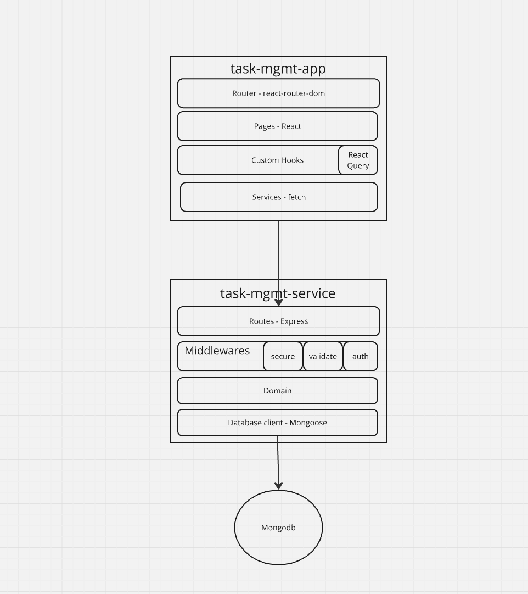

# Task Management Project

## Overall Architecture



### Task Management Service

#### Technical Decisions

- Validation Framework

  - Joi
    - Familiarity
    - Functional validator definitions
    - Data normalisation

  ```js
  Joi.object({
    username: Joi.string().alphanum().min(3).max(30).required(),
  });
  ```

  - Ajv
    - Claims to be faster
    - Possibility to share schema for open api doc generation - Not in this project unfortunately

- Folder Structure

```
src/
├─ routes/
├─ domain/
├─ db/
├─ middlewares/
```

Each layer provides solutions for different concerns and `domain` layer only consists of business logic\*

- Database
  - Mongodb: Syntax familiarity alongside with mongoose
  - mongoose to provide structured Models
  - `$text` index is helpful to simplify search functionality even though it doesn't work as I expected

#### Challenges

- Always double, triple check yaml files

```yaml
#wrong
command:
      - npm run dev
#correct
command: npm run dev
# 2 hours saved next time
```

- Too many layers to implement in order to secure a simple service

#### Todo

Even though too many layers are implemented, more are required still:

- Print stacktrace of errors only in dev
  - Logging an entire stack trace will be too costly on high traffic environment and would exhaust resources
- Healthcheck should also check DB connectivity
- Filter by dueAt interval
- There is only one test file
- Created task item should return a link for newly created item
- Slow start on docker container due to `tsx` installation, maybe use `nodemon`
- Inject env variables during CI/CD

### Task Management App

- State Management Framework:
  - Since data I received easily be displayed and since there was no eloborate use case I decided not to use any
- Build Tool:
  - Wanted to try Vite, easy to bootstrap
  - I didn't like the rule on env variables `VITE_SERVICE_URL`, reflects the build tool
- CSS
  - Tailwind due to widely available catalogue components
- ReactQuery
  - A real MVP together with `<Suspense />` and `componentDidCatch`
  - No more `isLoading`, `isError`
- Formik
  - Provides useful flags about registered form in order to manage form state

#### Challenges

- Visual Design
  - It's hard to come up with a design from a blank canvas
  - Could've used more time ordering items properly on desktop screen

#### TODO

- Filter for date intervals
- Logout functionality
- Logout if token expired and this happened during a request (e.g:task creation)
- Dockerize
